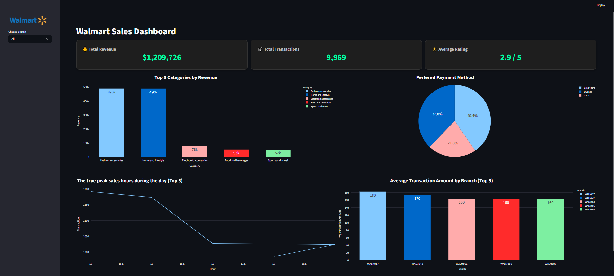

# 🛒 Walmart Retail Analytics Interactive Dashboard

An end-to-end retail analytics project designed to transform raw Walmart sales data into actionable business insights using Python, SQL Server, and Streamlit.

---

# 📌 Project Overview

This project demonstrates a complete data analytics workflow starting from raw CSV ingestion and ETL processing to SQL-based business analysis and interactive dashboard development.

The primary objective was to analyze Walmart retail transactions and uncover meaningful insights related to:

* Revenue performance
* Customer purchasing behavior
* Branch efficiency
* Peak sales activity
* Payment preferences

The project combines:

* Data Engineering
* SQL Analytics
* Data Visualization
* Business Intelligence

into a single integrated analytics solution.

---

# 🛠 Tech Stack

| Technology          | Purpose                             |
| ------------------- | ----------------------------------- |
| Python              | ETL & Data Processing               |
| Pandas              | Data Cleaning & Transformation      |
| SQL Server          | Data Storage & Analytical Queries   |
| SQLAlchemy + PyODBC | Database Connectivity               |
| Streamlit           | Interactive Dashboard Development   |
| Plotly              | Interactive Visualizations          |
| Git & GitHub        | Version Control & Portfolio Hosting |

---

# ⚙️ ETL Pipeline

The ETL pipeline was developed using Python to ensure data quality and consistency before loading into SQL Server.

## Key ETL Operations

* Imported raw Walmart sales dataset using Pandas
* Removed duplicate records
* Handled missing values
* Converted financial columns into numeric format
* Recalculated transaction totals for validation
* Exported cleaned dataset into SQL Server
* Generated reusable cleaned CSV output

## Data Validation

Several validation checks were performed:

* Duplicate detection
* Null-value inspection
* Revenue recalculation validation
* SQL integrity verification

---

# 🗄 Database & SQL Analytics

Advanced analytical SQL techniques were implemented using:

* CTEs (Common Table Expressions)
* Window Functions
* Ranking Functions
* Aggregate Analysis

## Business Questions Solved

### 1. Top Revenue-Generating Product Categories

Identified the top-performing product categories contributing to total sales revenue.

### 2. Branch Performance Analysis

Measured branch efficiency using:

* Average Basket Value
* Revenue Contribution
* Transaction Volume

### 3. Peak Sales Hours Detection

Detected peak operational hours using:

* Transaction counts
* Revenue distribution by hour

### 4. Customer Rating Analysis

Identified the highest-rated product category within each branch.

### 5. Payment Method Preferences

Analyzed customer payment behavior across branches.

---
## Business Value Delivered

The analysis helps retail stakeholders:

- Identify high-performing product categories
- Detect operational peak hours
- Evaluate branch profitability
- Understand customer purchasing behavior
- Improve payment handling strategies

# 📊 Interactive Dashboard

An interactive dashboard was developed using Streamlit and Plotly to provide real-time business exploration.

## Dashboard Features

* Dynamic branch filtering
* KPI cards
* Interactive charts
* Responsive layout
* Revenue tracking
* Transaction monitoring
* Payment analysis
* Business performance insights

---

# 📈 Dashboard Preview

<p align="center">
  
</p>

---

# 📂 Project Structure

```bash
Walmart-Retail-Analytics/
│
├── Dashboard.py
├── DA_Exploration.ipynb
├── Problem_Answers.sql
├── walmart_clean_data.csv
├── requirements.txt
├── README.md
└── walmart_Dashboard.png
```

---

# 🚀 How to Run

## 1. Clone the Repository

```bash
git clone https://github.com/mohammedkhafagy752000/walmart-retail-analytics.git
cd walmart-retail-analytics
```

## 2. Install Dependencies

```bash
pip install -r requirements.txt
```

## 3. Configure SQL Server

Update your SQL Server connection inside:

```python
create_engine(...)
```

---

## 4. Run the Streamlit Dashboard

```bash
streamlit run Dashboard.py
```

---

# 📌 Key Skills Demonstrated

* SQL Window Functions
* ETL Pipeline Development
* Data Cleaning & Validation
* SQL Server Integration
* Business Intelligence Reporting
* Interactive Dashboard Design
* Data Visualization
* Analytical Problem Solving

---

# 🔮 Future Improvements

* Sales Forecasting using Machine Learning
* Customer Segmentation
* Inventory Optimization Analytics
* Time-Series Analysis
* Real-Time Data Integration
* Cloud Deployment

---

# 📬 Author

**Mohamed Khafagy**
Data Analytics & Business Intelligence Enthusiast

[LinkedIn Profile](https://www.linkedin.com/in/mohammed-khafagy-7559aa272)
---

⭐ If you found this project useful, feel free to star the repository.
